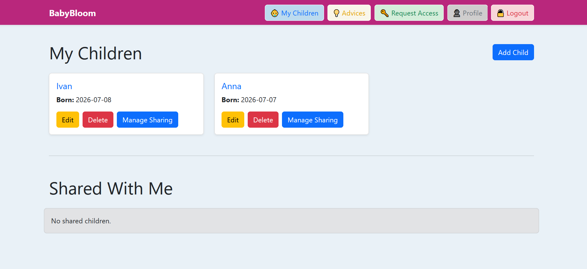
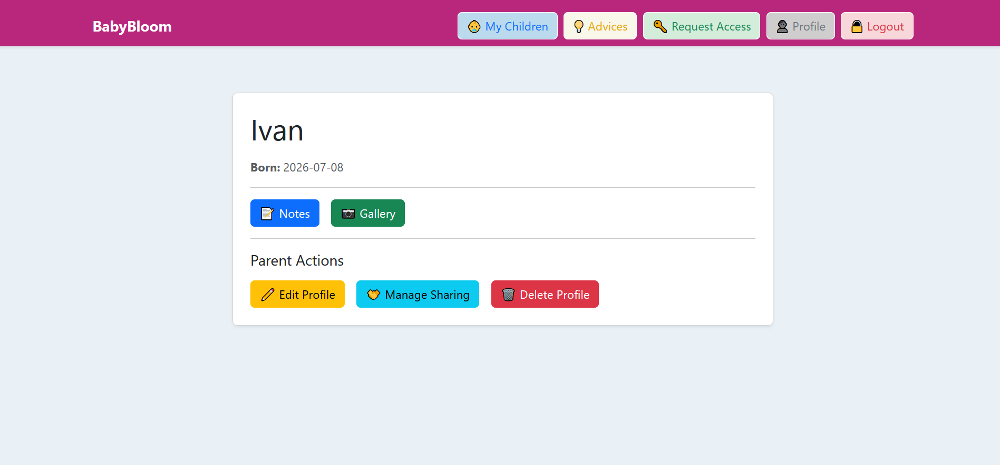
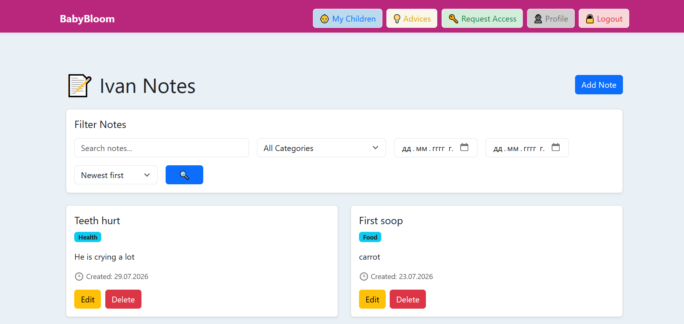
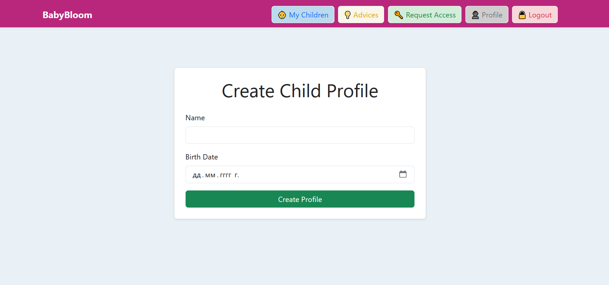
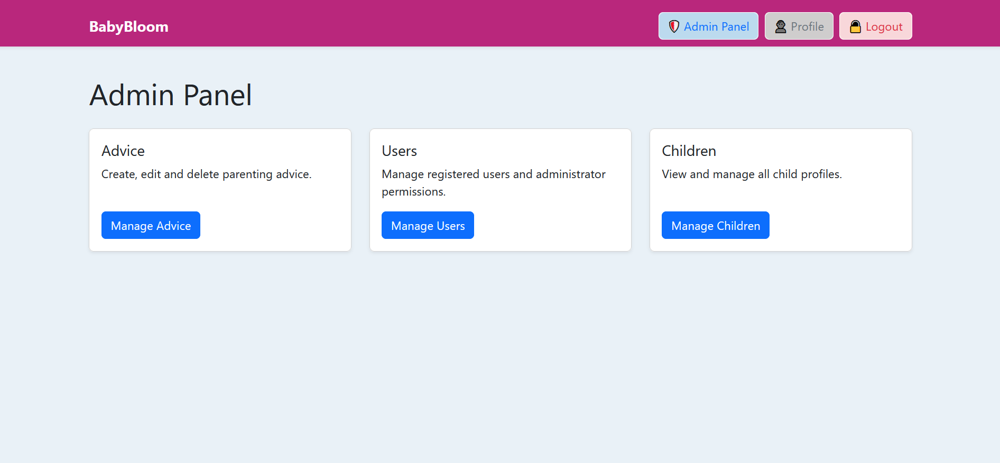

# 🌱 BabyBloom

BabyBloom is a web application that helps parents organize, store, and share important moments from their child's development.

The platform allows users to create child profiles, save important memories through notes and photos, receive parenting advice, and securely share access to child profiles with other users.

The application provides separate functionality for regular users and administrators.

---

# ✨ Features

## 👤 Authentication & User Management

- User registration and login
- Secure password hashing
- User profile management
- Role-based access control
- Admin authentication

# 👶 Child Profiles

Users can:

- Create child profiles
- Edit child information
- Delete child profiles
- View detailed child profiles
- Manage memories related to each child

# 📝 Notes

Each child profile can contain personal notes.

Features:

- Create, edit and delete notes
- Categories:
  - Health
  - Food
  - First Times
  - Other
- Search notes by keywords
- Filter notes by category
- Filter notes by date range
- Sort notes by newest or oldest

# 📷 Gallery

Users can store photos related to their children's development.

Features:

- Upload photos
- Add titles and descriptions
- Edit photo information
- Delete photos
- Search photos
- Filter photos by upload date
- Sort photos by newest or oldest

# 🔗 Sharing

BabyBloom supports controlled profile sharing.

Features:

- Generate temporary sharing codes
- Request access to another child's profile
- Approve or reject access requests
- Manage shared users
- Remove granted access

# 💡 Parenting Advice

Users can access parenting advice related to child development.

Administrators can manage advice content through the admin panel.

# 🛡️ Admin Panel

Administrators have access to a dedicated administration area.

Admin features:

- View registered users
- Manage users
- Manage parenting advice
- Access administrative functionality

Regular users do not have access to administrative pages.

---

# 🛠️ Technologies

## Backend

- Python
- Flask
- Flask-SQLAlchemy
- Flask-Login
- Flask-Migrate
- SQLAlchemy

## Database

- SQLite

## Frontend

- HTML5
- CSS3
- Bootstrap 5
- Jinja2 Templates

## Tools

- Git
- GitHub
- Virtual Environment (venv)

---

# 📸 Screenshots

## My Children



## Child Details



## Child Notes



## Create Child Profile



## Admin Panel



---

# 🚀 Installation and Running

Follow the steps below to download, configure, and run the BabyBloom application locally.

## 1. Clone the repository

Clone the repository from GitHub:

```bash
git clone <repository-url>
```

Navigate to the project directory:

```bash
cd BabyBloom
```

## 2. Create a virtual environment

Create a Python virtual environment:

```bash
python -m venv venv
```

Activate the virtual environment.

### Windows:

```bash
venv\Scripts\activate
```

### Linux / macOS:

```bash
source venv/bin/activate
```

## 3. Install dependencies

Install all required packages:

```bash
pip install -r requirements.txt
```

## 4. Apply database migrations

BabyBloom uses **Flask-Migrate** to manage database changes.

Apply the existing migrations:

```bash
flask db upgrade
```

This will create and update the database schema required by the application.

## 5. Run the application

Start the Flask development server:

```bash
python run.py
```

The application will be available at:

```
http://127.0.0.1:5000
```

## 6. Access the application

Open the application in your browser:

```
http://127.0.0.1:5000
```

Users can register and log in through the application interface.

The application supports two types of users:

- **Regular users** can manage child profiles, notes, gallery, sharing access, and view parenting advice.
- **Administrators** can access the admin panel and manage users, child profiles, and parenting advice.